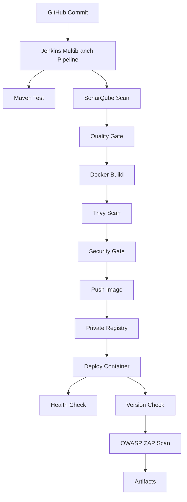

**Microservices CI/CD + DevSecOps Pipeline Lab (Jenkins + SonarQube + Trivy + ZAP)**

---

## 📌 專案介紹

本專案為一套 **Microservices CI/CD + DevSecOps Pipeline 實作 Lab**，  
以 Jenkins 為核心，整合 SonarQube、Trivy、OWASP ZAP、Docker 與 Private Registry，建立一條從程式碼提交到自動部署與安全驗證的完整交付流程。

此 Lab 以「**接近企業實務的最小可行架構**」為設計目標，重點在於：

- Pipeline as Code（Jenkinsfile）
- DevSecOps 安全整合
- 微服務獨立部署流程
- Artifact 與 Image 生命週期管理

---

## 🏗️ 系統架構

---

## ⚙️ 技術棧

### CI/CD

- Jenkins (Multibranch Pipeline)
- Pipeline as Code (Jenkinsfile)
- GitHub Webhook

### Backend

- Java / Spring Boot
- Maven

### Container

- Docker
- Docker Compose

### DevSecOps

- SonarQube（SAST）
- Trivy（Container Scan）
- OWASP ZAP（DAST）

### Registry

- Docker Hub
- Private Registry (`registry:2`)

---

## 🚀 Pipeline 流程

完整 CI/CD + DevSecOps 流程如下：

1. **SCM Trigger**
   - GitHub push → Jenkins 自動觸發
2. **Build & Test**
   - `mvn clean test`
   - `mvn package`
3. **Code Quality（SAST）**
   - SonarQube Scan
   - Quality Gate 控制
4. **Container Build**
   - Docker image build
   - tag：`build-${BUILD_NUMBER}`
5. **Security Scan（Container）**
   - Trivy image scan
   - 分為：
     - Report（artifact）
     - Security Gate（可阻擋 pipeline）
6. **Push Image**
   - Docker Hub（外部）
   - Private Registry（內部）
7. **Deployment**
   - 從 Private Registry pull image
   - `docker run` 啟動服務
8. **Post-deploy Verify**
   - `/actuator/health`
   - `/version`
9. **DAST Scan**
   - OWASP ZAP baseline scan
10. **Artifact 保存**
- Trivy report
- ZAP report

---

## 🔐 DevSecOps 設計重點

本 Lab 特別強調「安全左移（Shift Left）」與「安全整合」：

### ✅ 多層安全防護

| 類型             | 工具        | 說明         |
| -------------- | --------- | ---------- |
| SAST           | SonarQube | 程式碼靜態分析    |
| Container Scan | Trivy     | Image 漏洞掃描 |
| DAST           | ZAP       | 運行中服務測試    |

---

### ✅ Trivy 設計（關鍵亮點）

採用「**Report 與 Gate 分離**」設計：

- `Trivy Report`
  - 產出掃描結果（artifact）
- `Trivy Security Gate`
  - 根據 HIGH / CRITICAL 決定是否 fail pipeline

---

### ✅ Security Gate

- SonarQube Quality Gate（Code Level）
- Trivy Security Gate（Image Level）

---

## 🌟 專案亮點

### 🔹 1. 完整 DevSecOps Pipeline

- 不只是 CI/CD
- 包含 SAST + Container Scan + DAST

---

### 🔹 2. Microservices 架構

- `service-a`
- `service-b`
- 各自獨立 pipeline

---

### 🔹 3. Multibranch Pipeline

- `develop` → dev 環境
- `main` → prod 環境

---

### 🔹 4. Private Registry 整合

- 模擬企業內部 artifact repository
- build → push → deploy 全流程

---

### 🔹 5. Deployment Verification

- `/health`
- `/version`

 不只是 deploy，而是「可驗證交付」

---

### 🔹 6. Artifact 管理

- Trivy report
- ZAP report

可追蹤安全狀態

---

### 🔹 7. Rollback 能力

- 使用 image tag (`build-XX`)
- 可回滾至指定版本

---

## 📂 專案結構（簡化）

.  
├── service-a/  
│   ├── Jenkinsfile  
│   ├── Dockerfile  
│   └── src/  
│  
├── service-b/  
│   ├── Jenkinsfile  
│   ├── Dockerfile  
│   └── src/  
│  
├── docker-compose.dev.yml  
├── docker-compose.prod.yml  
└── jenkins/

---

## 🧪 驗證方式

### Dev 環境

http://localhost:8081/actuator/health

### Prod 環境

http://localhost:8082/actuator/health

---

## 📊 成果總結

本專案成功實現：

- ✅ CI/CD Pipeline 自動化
- ✅ DevSecOps 整合
- ✅ Container 化交付
- ✅ Image Registry 管理
- ✅ 自動部署與驗證
- ✅ 安全掃描與報告保存
